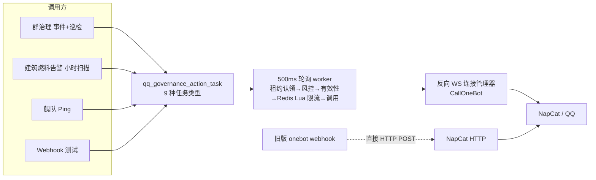

# QQ 机器人统一调度层：现状技术评审与重构方案

> 本文第 2、3 节描述当前实现行为（以代码为准）；第 4 节起为未实施的重构提案。提案落地后，必须将事实迁入对应的 `architecture`、`api` 和 `features/current` 文档。

## 1. 摘要

QQ 机器人能力目前的形态是：一个反向 WebSocket 传输层（NapCat → OneBot V11）、一个为群治理设计的持久任务队列（11 张表、9 种任务类型、500ms 轮询 worker、Redis Lua 限流、三级风控熔断），以及 5 个调用方。审查结论：

- **传输层形态合理但脆弱**：无心跳看门狗、单读循环同时处理事件与响应（队头阻塞）、调用无内置超时、成功与可重试判定依赖中文措辞子串匹配。
- **治理队列超载**：通知类任务（`notify`）寄居在治理队列中，靠 worker 特判跳过治理检查；通知幂等键含随机令牌导致去重永不生效；建筑告警"入队即标记已送达"；成功通知任务永不清理。
- **同一能力双传输双配置**：旧版 webhook 类型 `onebot` 直接 HTTP POST 到 NapCat，完全绕过队列、限流、重试与断连处理。

提案：建立独立的 **`qqbot` 调度域**（OneBot 客户端 + 限流 + 风控 + 消息 outbox），一切 QQ 机器人调用经由该域的两个契约接口（消息发送 `EnqueueMessages`、动作调用 `Call`）进出；群治理退化为调度域之上的策略域，消息外发获得真正的去重、送达记账与有界存储。

## 2. 现状盘点

### 2.1 传输层

NapCat 通过 OneBot V11 反向 WebSocket 连接 `GET /internal/onebot/v11/ws`（注册于 `server/internal/router/router.go:26-28`），全部协议层实现集中在 `server/internal/handler/qq_governance_onebot.go`（283 行）：

- **鉴权**（`validateOneBotReverseRequest` :61-98）：Bearer Token 常量时间比较 + `X-Self-ID` 必须等于配置的机器人 QQ + 源 IP 必须在 `onebot.allowed_cidrs` 内（默认 `127.0.0.1/32`）。握手刻意接受缺失 Origin 的请求（NapCat 不发送 Origin，注释 :52-54）。
- **连接管理**（:100-160）：单连接模式，新连接到来时关闭并替换旧连接（:131-138）；`onConnected` 仅在"此前无连接"时触发（:140-142）。无心跳/保活机制，静默死链只能在下一次读写失败时被发现。
- **读循环**（`handleMessage` :161-182）：在 WebSocket 读循环内**同步**执行事件反序列化与 `HandleOneBotEvent`（含数据库事务）。事件与动作响应共用这一条读循环，一次慢事务会阻塞后续所有入站事件与 echo 响应（队头阻塞），进而导致出站 `CallOneBot` 超时。
- **出站调用**（`CallOneBot` :203-230）：UUID echo → pending map → 加锁写入 → 阻塞等待响应。无内置超时（调用方必须自带 ctx）；成功判定包含对 `set_group_add_request` 的 NapCat "已处理"措辞特判（:225）。
- **可重试分类**（`retryableOneBotResponse` :231-239）：对中英文错误措辞做子串匹配。
- **入站事件**（`parseOneBotGovernanceEvent` :251-282）：仅接入 3 种事件——`request/group_add`、`notice/group_increase`、`notice/group_decrease`。

### 2.2 调用方清单（5 个）

| # | 调用方 | 入口 | 到达 QQ 的路径 |
|---|--------|------|----------------|
| 1 | **QQ 群治理**（审批/拒绝/名片/踢人 + 15 分钟对账巡检） | OneBot 事件 + cron `qq_group_governance_reconcile`（`0 */15 * * * *`，`server/jobs/qq_governance.go:14-29`） | 事件评估（`service/qq_governance.go:100-261`）与巡检（`service/qq_governance_reconcile.go`）→ 入队 `approve/reject/set_card/kick/snapshot/refresh_group_info/compute_batch/recheck` → worker → 反向 WS |
| 2 | **军团建筑燃料/增强告警** | cron `corporation_structure_alert_scan`（每小时，`server/jobs/corporation_structure_alert_scan.go`）→ `RunAlertScan`（`service/corporation_structure.go:626-743`） | 阈值检查 + 边缘触发去重（`corp_structure_alert_state`）→ `EnqueueStructureAlertNotifications`（:735）→ `notify` 任务 → worker → 反向 WS |
| 3 | **舰队 Ping** | `CreateFleet` 中裸 `go func()` 异步触发（`service/fleet.go:181-187`）→ `WebhookService.SendFleetPing`（`service/sys_webhook.go:153-210`） | webhook 类型为 `qq_governance_onebot` 时 → `EnqueueGroupNotifications`（:202-207）→ `notify` 任务 → worker → 反向 WS |
| 4 | **Webhook 测试发送** | `WebhookService.SendTest`（`service/sys_webhook.go:213-230`） | 同上（:223-228） |
| 5 | **旧版 webhook 类型 `onebot`**（遗留） | 同为 `SendFleetPing`/`SendTest`，`cfg.Type != "qq_governance_onebot"` 时走 `sendMessage` | **直接 HTTP POST** 到 `/send_group_msg` / `/send_private_msg`（`sys_webhook.go:251-267`），自带独立 token（:282-284），绕过队列/限流/重试/断连处理 |

调用方 → 传输路径全景：



### 2.3 任务机制解剖

- **表结构**：`qq_governance_action_task`（`server/internal/model/qq_governance.go:171-193`，20 列：ActionType / IdempotencyKey / GroupID / QQ / TargetVersion / PayloadJSON / Status / Priority / RetryCount / RunAfter / 租约三元组 / Source / RetryCause / LastError 等）。QQ 子系统共 11 张表（事件、策略、成员态、巡检 run/member、运行时快照、审查、任务、动作日志、风控态、告警）。
- **状态机**：`pending → running → succeeded | retry_wait → … → dead`（最多 5 次重试，退避 45s / 3m / 15m / 45m，`service/qq_governance_worker.go:146-157`）；死信产生治理页告警，需管理员手工重试。
- **认领**：`ClaimNextActionTask`（`server/internal/repository/qq_governance.go:384-410`）条件更新租约（30 秒），每轮最多扫描 10 个候选。
- **worker 流水线**（`RunActionWorkerOnce` :40-93）：认领 → 巡检类任务路由（:49-51）→ 风控门控 `riskWait` → 有效性复查 `actionStillValid` → Redis Lua 令牌桶限流（全局 3 个/3s、群 1 次/8s、踢人 30s、QQ 维度 1 次/min，:230-291）→ `CallOneBot`（10s ctx）→ 动作日志 → 风控结果统计 → 完成。
- **notify 特判**：通知任务跳过大部分治理检查（worker :49、:96-99），payload 结构体混合了 RequestFlag / Card / RunID / Batch / Message 五种不相干字段。
- **通知入队**（`service/qq_governance.go:276-316`）：同一事务内按群插入 `notify` 任务，幂等键格式 `{source}-notify:{group}:{随机16字节token}`（:301）。
- **重连恢复**：WS 重连时 `OnOneBotConnected`（`service/qq_governance_admin.go:347-359`）将 `retry_cause=onebot_disconnected` 的 `retry_wait` 任务批量翻回 `pending`；死信不自动恢复。
- **清理**：`RunGovernanceMaintenance`（每日 03:20）只清理事件 90 天、审查/日志 180 天（`repository/qq_governance.go:561-571`）——**任务表（含成功 notify）不在清理范围**。

### 2.4 调度子系统对照

后端同时存在四套"何时执行"机制，QQ 相关路径横跨其中三套：

| 机制 | 载体 | 锁/去重 | 历史 | QQ 相关用途 |
|------|------|---------|------|-------------|
| robfig/cron + taskregistry | `server/bootstrap/cron.go` + `server/internal/taskregistry/registry.go`，16 个 job（`server/jobs/jobs.go`），`task_schedules` 表可覆盖 cron 表达式 | 进程内互斥锁 | `task_executions` 表 + 任务管理页 | 触发群治理巡检（15min）、治理维护（03:20）、建筑告警扫描（每小时） |
| ESI 队列 | `server/pkg/eve/esi/queue.go`（`esi_refresh` cron 每 5 分钟驱动） | 优先级引擎 + 信号量 + Redis last-run | Redis | 建筑快照数据源（`task_corporation_structures.go`，6h/24h 刷新） |
| background.Manager | `server/pkg/background/manager.go` | 无（goroutine 生命周期池） | 无 | QQ 治理 worker goroutine 本身；舰队 Ping 的裸 `go func()` **不在**其中 |
| QQ DB 队列 | `qq_governance_action_task` + 500ms ticker | DB 租约 + 幂等键 + Redis 令牌桶 | 动作日志表 + 治理页 | 所有 QQ 读写的实际执行 |

### 2.5 配置面

全部在 DB `system_config`（无环境变量）：

- 传输：`onebot.enabled` / `onebot.access_token` / `onebot.bot_qq` / `onebot.allowed_cidrs`（`server/internal/model/sys_config.go:41-47`）。
- 治理：`qq_governance.scan_interval_minutes` / `mismatch_confirmations` / `mismatch_observation_hours`。
- 告警：`dashboard.corporation_structures_alert_enabled` / `alert_group_ids` / `fuel_notice_threshold_days` / `timer_notice_threshold_days` / `authorizations`（sys_config.go:52-56）。
- 旧版 webhook：`webhook.*`（含 onebot URL/OBToken/OBTarget）——与 `onebot.*` 完全独立的双配置。

管理面：`/system/qq-governance` 下 19~20 个端点（`router.go:655-677`，super_admin + system.manage）；Vue 管理页 987 行（`static/src/views/system/qq-governance/index.vue`），React 迁移页 343 行。

## 3. 问题清单

### P0（正确性缺陷，用户可观测）

| 编号 | 现象 | 证据 | 后果 |
|------|------|------|------|
| P0-1 | notify 幂等键内嵌每次入队新生成的随机令牌，`CreateActionTaskIfAbsent` 的唯一约束永不命中 | `service/qq_governance.go:295-311`（键格式 :301） | 生产方任何重试（webhook 重发、告警扫描在结算前重跑）都会产生第二个 `notify` 任务 → 群里重复消息；函数注释声称的"幂等"实际失效 |
| P0-2 | 建筑告警在**入队后立即**标记告警状态为 Delivered | `service/corporation_structure.go:735-740` | notify 任务死信（如机器人离线超过重试窗口）时告警静默丢失，且状态显示"已送达"；结构退出再进入阈值窗口前不会重发 |
| P0-3 | 成功的 notify 任务永不清理 | `repository/qq_governance.go:561-571`（Cleanup 仅覆盖 event/review/log）；`bootstrap/db.go:392` 的 ready 部分索引随之膨胀 | `qq_governance_action_task` 无界增长，轮询扫描与治理页任务列表持续劣化 |

### P1（稳定性与可运维性）

| 编号 | 现象 | 证据 | 后果 |
|------|------|------|------|
| P1-1 | WS 读循环同步执行事件处理（含 DB 事务），事件与响应共用一条循环 | `handler/qq_governance_onebot.go:152-182` | 一次慢事务队头阻塞全部入站流量，出站调用连锁超时 |
| P1-2 | 无心跳/看门狗，静默死链无感知 | 同上 :100-160 | 死链期间任务堆积为 `retry_wait/onebot_disconnected`，依赖 NapCat 主动重连才恢复 |
| P1-3 | `CallOneBot` 无内置超时；成功判定含"已处理"措辞特判；可重试性靠中英文子串匹配 | 同上 :203-239 | 调用方忘记带 ctx 即永久阻塞；NapCat 升级改动措辞即破坏分类 |
| P1-4 | `scan_interval_minutes` 设置撒谎：校验 15-360 分钟（`service/sys_config.go:164-193`），但巡检 cron 硬编码 15 分钟（`jobs/qq_governance.go:17`），设置仅用于快照过期启发式（`service/qq_governance_admin.go:281`） | — | 管理员调整无效却被系统接受；实际节奏已可由 `task_schedules` 覆盖，设置项是冗余且误导的机制 |
| P1-5 | 双传输双配置：旧版 webhook `onebot` 直连 HTTP，独立 token | `service/sys_webhook.go:251-267`、`:282-284` | 同一功能两套语义；旧路径无队列/限流/重试/断连保护，是稳定性最薄弱的发送通道 |
| P1-6 | worker 单 goroutine、500ms tick、每 tick 认领 1 个任务，吞吐上限约 2 任务/秒 | `service/qq_governance_worker.go:17-45` | 通知突发时排队分钟级；舰队 Ping 延迟放大 |
| P1-7 | 舰队 Ping 用裸 `go func()` 异步发送 | `service/fleet.go:181-187` | 不受 background.Manager 管理，进程关闭即丢失，错误仅日志一行 |
| P1-8 | 风控熔断窗口混合读失败与写失败；二级触发条件包含对错误文本匹配"风控"子串 | `service/qq_governance_risk.go:45-100` | QQ 侧读取故障（快照/群信息）可打开写熔断，误伤踢人/名片；措辞依赖脆弱（同 P1-3） |

### P2（结构与可维护性）

| 编号 | 现象 | 证据 | 后果 |
|------|------|------|------|
| P2-1 | 限流数学双实现：worker 内联 Lua（每次 EVAL，无脚本缓存）+ Go 复刻供管理页读数 | `service/qq_governance_worker.go:230-291` 与 `service/qq_governance_rate.go:34-103` | 两处可静默漂移 |
| P2-2 | 通知寄居治理队列：9 种任务类型共用一个表与 worker，notify 靠特判跳过治理逻辑，payload 混装 5 种字段 | `service/qq_governance_worker.go:49,96-99`、`service/qq_governance.go` payload 结构 | 治理与通知耦合，双方都难演进；通知洪峰挤占治理任务列表与观测面 |
| P2-3 | 双成员状态机：事件路径 `recordDecision` 与巡检路径 `reconcileMember` 各自实现版本递增/状态迁移/审查记录/任务入队 | `service/qq_governance.go:198-261` 与 `service/qq_governance_reconcile.go:330-392` | 同一业务规则两处维护 |
| P2-4 | 巡检为自链 DB 任务链（snapshot → refresh_group_info + compute_batch → compute_batch → …），人均约 2 个事务 + 5 次查询 | `service/qq_governance_reconcile.go:120-321` | 任务机制臃肿的主要来源：一次周期扫描被展开为无界任务行链 |
| P2-5 | 错误吞没普遍：`_ =` 丢弃快照保存/审计/告警创建，payload marshal 错误忽略，worker 循环日志不含 error 对象 | `service/qq_governance_reconcile.go:190,209`、`service/qq_governance_worker.go:27` 等 | 故障定位困难 |
| P2-6 | 四套调度机制并存且边界未文档化（module-map 缺 QQ 队列条目） | `docs/architecture/module-map.md` | 新人无法判断"该用哪个机制" |
| P2-7 | 阈值逻辑双写：`RunAlertScan` 与导航角标 `CountAttentionStructures` 手写同一套规则 | `service/corporation_structure.go:588-607, 689-704` | 改阈值规则需改两处 |
| P2-8 | 死代码：`GetLatestRequestFlag` 无调用方 | `repository/qq_governance.go:289-296` | 噪音 |

## 4. 目标与非目标

### 目标

1. **单一传输**：一切 QQ 机器人调用（读写、消息、治理动作）经由唯一传输层与唯一配置。
2. **单一限流与风控实现**：令牌桶与熔断只实现一次，管理页读数与执行共用同一份数学。
3. **真正的去重与送达记账**：消息幂等键确定性生成；"已送达"只代表实际发出成功。
4. **诚实的设置项**：设置要么控制行为，要么删除。
5. **有界存储**：所有队列/日志类表有保留策略。

### 非目标

- 多机器人、多实例连接选主（维持单连接单实例）。
- 吞并其余三套调度机制（cron/taskregistry、ESI 队列、background.Manager）——QQ 外发队列因其"逐操作持久化 + 跨重启租约 + QQ 专属限流/风控"需求而独立存在，属合理分野（见 5.7）。
- 私聊群发、消息模板平台化。
- 修改 OneBot 协议端点路径（NapCat 无需重新配置）。

## 5. 目标架构

### 5.1 命名与文件布局

新建 `qqbot` 域（OneBot 是协议名、qq_governance 是策略消费者，共享层需要平台能力名），全部位于 `server/internal/`：

| 文件（新） | 吸收/替代 | 职责 |
|------------|-----------|------|
| `handler/qqbot_websocket.go` | 重命名 `handler/qq_governance_onebot.go` | 反向 WS 端点、鉴权三要素、协议解复用。路由路径不变 |
| `service/qqbot_client.go` | 现 handler 内的连接管理器 | 连接生命周期、echo map、序列化写入、**默认 15s 超时**、last-frame 看门狗、入站事件经有界 channel 转独立 goroutine（解队头阻塞） |
| `service/qqbot_errors.go` | `retryableOneBotResponse`、`OneBotActionError` | 错误分类学：`disconnected / timeout / send_failed / retcode_permanent / retcode_transient / parse`，retcode 优先、措辞兜底 |
| `service/qqbot_rate.go` | worker 内联 Lua + `qq_governance_rate.go` | 唯一令牌桶实现（Lua 常量 + EVALSHA），管理页读数同源。Redis key 改 `qqbot:rate:*` |
| `service/qqbot_risk.go` | `qq_governance_risk.go` | 风控熔断，读/写失败窗口分离；删除"风控"子串触发（措辞仅留在错误分类兜底） |
| `service/qqbot_dispatch.go` | `EnqueueGroupNotifications` / `EnqueueStructureAlertNotifications` / worker notify 分支 | Dispatcher：`EnqueueMessages`、唤醒式 drain worker（channel 通知 + 兜底 tick）、重试/死信/清理/状态读数 |
| `model/qqbot.go` + `repository/qqbot.go` | 新增 | `QQBotMessage` outbox 表及其仓储（租约认领模式复用 `repository/qq_governance.go:384-436` 的 SQL，抽共享 helper） |
| `jobs/qqbot.go` | 新增 | `qqbot_message_cleanup`：delivered 保留 7 天、dead 保留 90 天 |

治理侧瘦身后保留：`service/qq_governance.go`（仅事件+评估）、`qq_governance_reconcile.go`（循环 job）、`qq_governance_worker.go`（仅 4 种动作）、`qq_governance_admin.go`。删除：`qq_governance_rate.go`、`qq_governance_risk.go` 及 worker/enqueue 中的 notify 分支。

### 5.2 契约接口（"统一调度"的落点）

领域代码**永不**直接触碰 WS 执行器，只有两个入口：

```go
// 消息发送方（建筑告警、舰队 Ping、webhook 测试）
// 幂等键 = source:dedupe_key:group_id，确定性生成，生产者重试真正去重
EnqueueMessages(req EnqueueRequest) (EnqueueResult, error)
// EnqueueRequest{ Source, DedupeKey string; GroupIDs []int64; Content string }

// 治理动作与巡检读取
// OpClass = Read | Write | HeavyWrite(kick)，决定限流桶选择、风控门控与超时
Call(ctx context.Context, action string, params map[string]any, class OpClass) (json.RawMessage, error)
```

### 5.3 队列拓扑：拆分为 outbox + 瘦身动作队列

评估过的三个选项：

1. **一个统一大队列**（任务类型隔离）——被否决：版本校验的副作用操作与高频即发消息的有效性语义、保留期（消息 7 天 vs 治理审计 180 天）、管理界面（Ping 洪峰会淹没踢人任务列表）全不同，合并只是把当前的病换一张表。
2. **通知不落库（进程内缓冲发送）**——被否决：重启丢失飞行中的舰队 Ping 与建筑告警；NapCat 重连是常态；且无法跨重启去重生产者重试。安全相关消息必须可持久。
3. **拆分双表 + 单执行内核（采纳）**：`qqbot_message` outbox 归调度域；`qq_governance_action_task` 瘦身为 4 种版本校验写动作（approve/reject/set_card/kick）。必须单例的能力（传输、限流、风控、错误分类、重试语义）在 `qqbot` 包内只实现一次；真正不同的部分（有效性门控、保留期、管理 UX）分开。代价是两个认领循环，通过抽取共享租约认领 helper（约 100 行复用）缓解。两个队列间的操作顺序无关紧要——**限流器才是 QQ 访问的真正串行点**。

`qqbot_message` 表：`id, idempotency_key(unique), source, dedupe_key, group_id, content, status(pending|delivered|dead), retry_count, run_after, lease_token/claimed_at/lease_expires_at, last_error, created_at, delivered_at`。索引：唯一幂等键；(status, run_after) ready 轮询部分索引（镜像 `bootstrap/db.go:392`）；(source, dedupe_key) 供告警结算。重试阶梯短于治理（15s / 1m / 5m / 15m，最多 4 次 → 死信）——迟到 45 分钟的舰队 Ping 没有价值。

### 5.4 巡检：自链任务 → 有检查点的循环 job

保留好的部分：run/member 冻结模型与 active-run 唯一部分索引（`bootstrap/db.go:391`）本身就是检查点与并发防护。删除任务链表演：`qq_group_governance_reconcile` job 的 RunFunc 变为——查找或创建 active run → 直接以 client `Read` 调用 `get_group_member_list` / `get_group_info`（限流照走，L3 豁免同现状）→ 在时间预算内（约 10 分钟）按批 50 循环处理 pending 成员（同一 `applyMemberEvaluation`）→ 完成则关闭 run 并标记缺失成员离群。断点续跑 = 下个 cron tick 继续 pending 行；`scheduleLock` + active-run 唯一索引已防并发。删除 5 种任务类型：`snapshot` / `refresh_group_info` / `compute_batch` / `recheck`（暂态失败的复查天然被下一轮循环覆盖）/ `notify`。人均成本从约 2 事务 + 5 查询降为 1 事务。

### 5.5 告警结算（修复 P0-2）

建筑告警扫描改为结算制：入队时带确定性 `DeduKey`（如 `fuel:{structureID}:{窗口起点}`）；每小时扫描按 (source, dedupe_key) 查询 outbox——`delivered` → 标记 Delivered；`dead` → 重新入队一次（新 dedupe_key），仍死信则进管理面告警；`Active` 且未 Delivered 且无对应消息 → 补入队。

### 5.6 Redis 立场

保持硬依赖（跨重启的多桶协同限流恰是本地兜底会静默破坏的；QQ 账号安全优先于可用性），但重新定义失败语义：Redis 不可用 = 调度域**暂停**（任务停留 pending/retry_wait，cause=`limiter_unavailable`，永不因此死信、永不绕过）。状态端点上报限流器可用性（现有 UI 已渲染）。

### 5.7 调度子系统边界声明

QQ 外发**不并入** taskregistry 或 ESI 队列：taskregistry 是粗粒度 cron + 进程内互斥 + 历史；ESI 队列是 API 预算优先级引擎；background.Manager 是 goroutine 生命周期。QQ outbox 需要"逐操作持久化 + 跨重启租约 + QQ 专属限流/风控协调"，分野成立，落地时在 `docs/architecture/module-map.md` 记录一次。

### 5.8 管理面

新增 `/system/qqbot`（super_admin）：`GET /messages`（按 status/source 过滤）、`POST /messages/:id/retry`、`GET /status`（连接 + 令牌桶 + 风控级别 + 队列深度 + 死信数）。`/system/qq-governance` 保留瘦身后的 4 类任务列表与既有端点；其连接卡迁移至 `/system/qqbot/status`。前端：Vue `static/src/api/qqbot.ts` + 治理页内新分区（或兄弟视图）；React `static-react/src/api/qqbot.ts` + `types/api/qqbot.ts` + 页面同步。

## 6. 迁移路径

### Phase 1 — 传输与内核整备（行为保持，无 API/DB 变更）

范围：handler 重命名 `qqbot_websocket.go`；连接管理器抽取为 `service/qqbot_client.go`；读循环解复用（echo → pending channel；事件 → 有界 channel + 独立 goroutine）；last-frame 看门狗（约 180s 静默断开，触发既有重连恢复路径）；`Call` 默认 15s 超时；`qqbot_errors.go` 分类学（retcode 优先，"已处理"特判收编为分类兜底）；限流 Lua 与风控迁入 `qqbot_rate.go` / `qqbot_risk.go`（key 重命名 `qqbot:rate:*`），删除 Go 复刻实现，风控读写窗口分离；worker 循环日志带 error 对象。

测试：`handler/qq_governance_onebot_test.go`（→ `qqbot_websocket_test.go`）新增——慢事件处理器不阻塞 echo 交付、看门狗到期断连、错误分类表驱动用例、限流脚本、风控窗口分离；既有 `service/qq_governance*_test.go` 必须原样通过（行为保持门禁）。

文档：`docs/architecture/module-map.md`（文件重命名）、`runtime-and-startup.md` 小节。

### Phase 2 — 消息外发域切换（统一化核心，干净切割）

范围：`model/qqbot.go` + AutoMigrate；dispatcher（唤醒式 drain）；重接 `sys_webhook.go`（qqNotifier → dispatcher）、`corporation_structure.go`（入队带 DedupeKey + 结算制）、`fleet.go`（同步入队，删除裸 goroutine，错误返回调用方）；从治理队列删除 notify（迁移时清理存量 pending/succeeded notify 行——干净切割）；**移除旧版 webhook 类型 `onebot`**（连带 OB 字段与前端选项，按"不留兼容层"规则）；`jobs/qqbot.go` 清理任务；`/system/qqbot` 路由；Vue + React UI。

测试（按 `docs/standards/testing-and-verification.md`）：确定性键去重（同 DedupeKey 重复入队只发一次）；重试阶梯到死信；结算制三分支幂等；webhook 校验拒绝旧类型；舰队 Ping 入队错误上抛；治理 19 端点回归。

文档：`docs/features/current/qq-group-governance.md`（notify 章重写）、`corporation-structures.md`、`administration.md`（webhook）、`docs/api/route-index.md`、module-map、CHANGELOG（管理员迁移提示：旧 webhook 需重建为 `qq_governance_onebot`；Redis key 变更）。

### Phase 3 — 巡检回路简化 + 治理瘦身

范围：循环 job + 时间预算替代 snapshot/refresh_group_info/compute_batch/recheck 任务链（删除 4 个常量与 worker 分支）；统一 `applyMemberEvaluation` 状态机（事件路径与循环共用）；删除 `scan_interval_minutes`（sysconfig 校验 `sys_config.go:164-193` 与双前端设置 UI），巡检节奏由任务管理器 `task_schedules` 控制；worker 文件缩至 4 种类型；顺带清理 P2-7（阈值逻辑抽取）与 P2-8（死代码）。

测试：模拟重启后 run 续跑（pending 行继续）；双重触发下 active-run 唯一性；kick/set_card 入队不变量；设置 schema 无已删字段。

文档：qq-group-governance.md（巡检章）、task-manager.md（巡检节奏改为 schedule 驱动）、双前端功能说明、settings DTO 若变更则 route-index。

### 可选 Phase 4 — 打磨

合并观测指标；将本报告的决策记录升格为 `docs/architecture/qqbot-dispatch.md` 权威页；私聊支持的取舍决策。

**排序理由**：Phase 1 交付 2/3 阶段消费的内核原语；Phase 2 先行因其修复两个用户可观测的 P0 正确性谎言；Phase 3 纯治理内部，可独立交付。

## 7. 风险与开放问题

- **NapCat 措辞漂移**：错误分类以 retcode/echo 为准后仍保留措辞兜底（"已处理"短期无法去除）；需在测试中固定已知措辞样本。
- **连接接管语义**：新连接关闭旧连接时，旧连接飞行中的 `Call` 如何归类（应作为 `disconnected` 可重试错误返回，而非挂到超时）。
- **L3 风控期间消息发送立场**：现状 L3 暂停所有写（含通知）。提案维持——账号安全优先，建筑告警走结算制自愈补偿。
- **看门狗误报**：NapCat 心跳（`meta_event/heartbeat`）若未开启，180s 静默即断连；部署文档需注明 NapCat 心跳间隔要求。
- **Redis 单点**：QQ 路径可用性与 Redis 绑定（提案维持，见 5.6），运维需知晓。
- **task_schedules 编辑 UX**：删除 `scan_interval_minutes` 后，改巡检节奏需在任务管理器编辑 cron 表达式，对管理员的可发现性下降，需页面提示。

## 8. 附录

### A. 受影响文件清单

现有（Phase 1-3 将修改/删除）：`handler/qq_governance_onebot.go`、`service/qq_governance{,_worker,_reconcile,_risk,_rate,_admin}.go`、`repository/qq_governance.go`、`model/qq_governance.go`、`service/sys_webhook.go`、`service/corporation_structure.go`、`service/fleet.go`、`service/sys_config.go`、`bootstrap/cron.go`、`bootstrap/db.go`、`router/router.go`、`jobs/qq_governance.go`、`static/src/views/system/qq-governance/index.vue`、`static/src/api/qq-governance.ts`、`static/src/types/api/api.d.ts`、`static/src/views/system/webhook/index.vue`、`static-react/src/pages/system-qq-governance-page.tsx`、`static-react/src/api/qq-governance.ts`、`static-react/src/types/api/qq-governance.ts`、双端 i18n（zh/en）。

新增：`handler/qqbot_websocket.go`（重命名）、`service/qqbot_{client,errors,rate,risk,dispatch}.go`、`model/qqbot.go`、`repository/qqbot.go`、`jobs/qqbot.go`、`handler/qqbot_admin.go`、`static/src/api/qqbot.ts`、`static-react/src/api/qqbot.ts`、`static-react/src/types/api/qqbot.ts`。

### B. 验收清单（重构完成后）

- [ ] 5 个调用方全部经由 `qqbot` 契约接口，grep 无直连 WS/HTTP 发送残留
- [ ] 同 DedupeKey 重复入队仅发送一次
- [ ] 建筑告警"Delivered"等价于 outbox delivered
- [ ] 所有队列/日志表有保留策略且清理 job 生效
- [ ] `scan_interval_minutes` 不存在于设置面与代码
- [ ] 限流/风控各只有一份实现，管理页读数与其同源
- [ ] 断开 NapCat → 任务等待；重连 → 自动恢复；Redis 停机 → 暂停不绕过不误死信
- [ ] 双前端（Vue/React）管理面同步

### C. 与 2026-07 OneBot 集成草案的差异

`docs/specs/draft/qq-group-governance-onebot-integration.md` 中存活的决策：NapCat 仅做协议端、决策全在 AmiyaEden、DB 持久任务 + 租约、Redis 限流三级维度、退避与死信边界、反向 WS 鉴权三要素。已腐化/未预见的部分：草案未预见通知类调用方进驻治理队列（舰队 Ping、建筑告警、webhook 测试的后来的搭车）；未预见旧 `onebot` webhook 双通道并存；草案假设的通用任务复用方向与最终"专属队列"决定一致，但队列随后演化为 9 种类型的单表混合体——这正是本报告要纠正的漂移。
